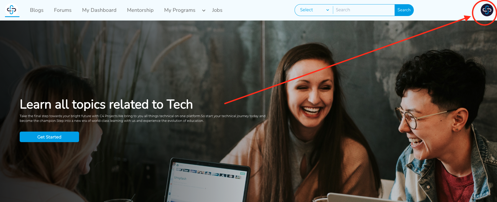
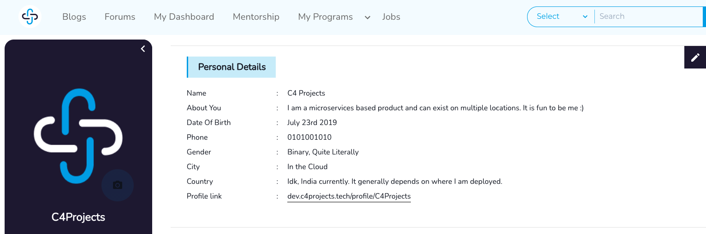
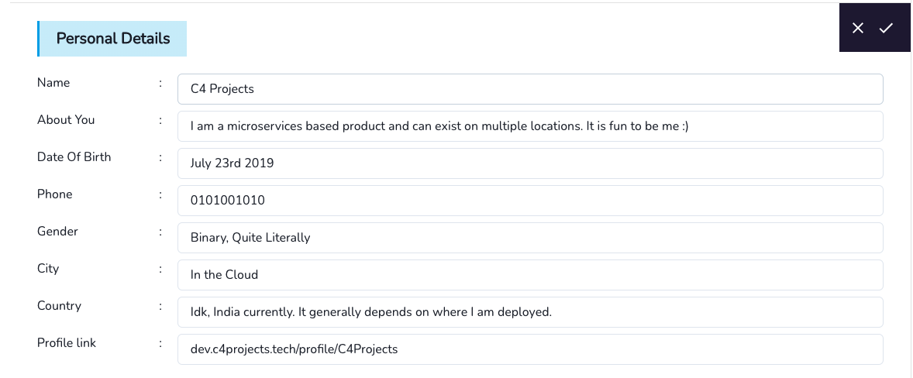
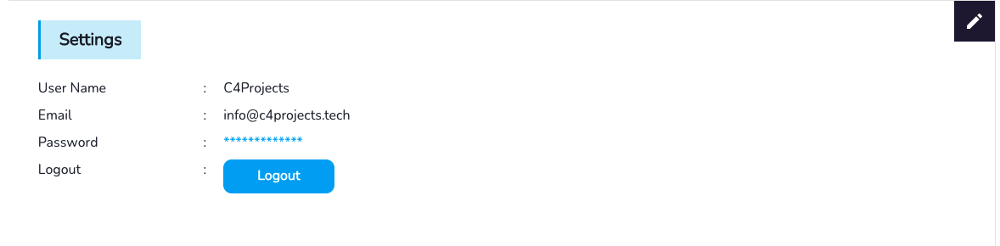
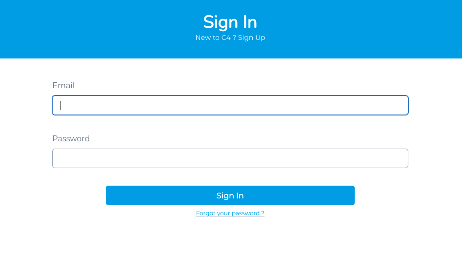

# Task 1

- First thing's first, let's edit your profile and get familiar with the platform :)

## Profile
- Click on the right-hand corner of your screen, A drop down will let you into the profile section

- You will now see your profile page, you can share your profile page with prospective employers using the link provided :)

- You can click on the camera icon to change your profile image. 
- It is recommended to have an image to ensure that the mentors as well as recruiters can feel more familiarised with you.
- You can also edit your personal details. It is recommended to have a strong introduction as well.

## General Instructions
- To change your password:
  - If logged in:
  - Scroll down on your profile page to see the settings section, here you can click on the pencil to change your password.
  
  - If not:
  
  
  
  ## Get in Touch
  If you have any doubts please get in touch on:
  
  info@c4projects.tech
